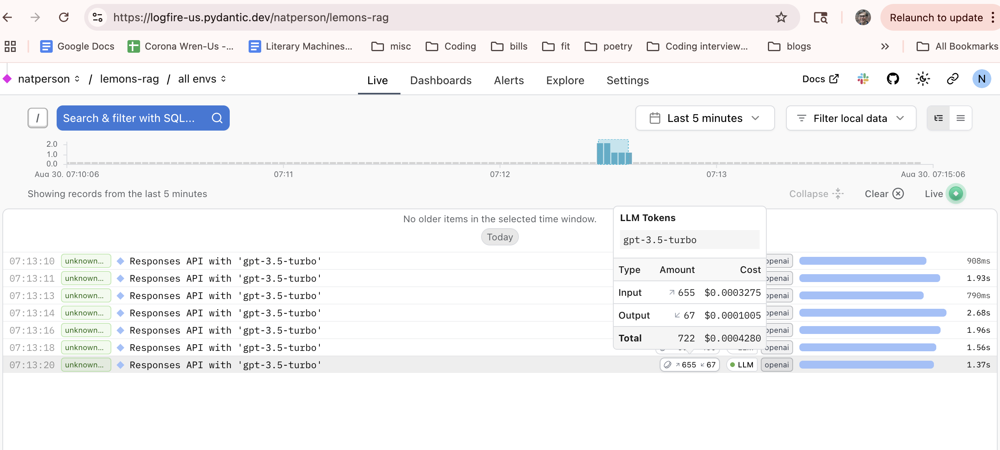

Create virtual env with `uv venv`
Started with `source .venv/bin/activate`
Added fitz with `uv add fitz`

Futzed around trying to parse the 'how-to-not-fail-lemons-tech-inspection.pdf' with fitz.
Got it working but realized that this doc was non-heirarchical, so I was using wrong strategy.
This code is in 'structure_analyzer.py'. Not the right strategy for this file.

I ran into some errors around

Changed tacks to scrape the rules from https://24hoursoflemons.com/prices-rules and use a script
to put them into a structure. After installing chromedriver, used `scraper.py` to scrape the content
and extract the rules into json with a regex for detecting hierarchy. claude had a typo
and the script fell back to using requests instead of BeautifulSoup - but we ended up extracting
the content into `lemons_rules.json`, which I'm committing.

Now took the scraped json and claude created a script called `web_rule_parser.py` to make it into a
hierarchal document. web_rule_parser took lemon_rules.json (which only had the 6 top-level rules)
and parsed them into `parsed_rules.json`, which contains all the sub-rules with the hierarchy in place to be used as chunks.

My current flow is:
scrape --> structured json

Next, I asked claude to help with chunking and vectorizing. I used `rule_chunker.py` to take the
structured json, use each rule as a "chunk" for retrieval, and vectorize the results, the output of the above step was `rule_embeddings.npy`. Getting close so I didn't look very closely at the code. Did a sanity check with the output and things looked okay.

I had to set up an openAI account and fund it to get the chatbot style responses.

I also added logfire to rag_system.py, which instruments the api calls and shows token usage.

